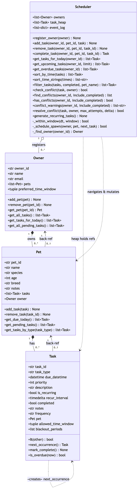

# PawPal+ (Module 2 Project)

You are building **PawPal+**, a Streamlit app that helps a pet owner plan care tasks for their pet.

## Scenario

A busy pet owner needs help staying consistent with pet care. They want an assistant that can:

- Track pet care tasks (walks, feeding, meds, enrichment, grooming, etc.)
- Consider constraints (time available, priority, owner preferences)
- Produce a daily plan and explain why it chose that plan

Your job is to design the system first (UML), then implement the logic in Python, then connect it to the Streamlit UI.

## What you will build

Your final app should:

- Let a user enter basic owner + pet info
- Let a user add/edit tasks (duration + priority at minimum)
- Generate a daily schedule/plan based on constraints and priorities
- Display the plan clearly (and ideally explain the reasoning)
- Include tests for the most important scheduling behaviors

## ✨ Features

- **Sorting by time** — orders tasks chronologically by `due_datetime` (`Scheduler.sort_by_time`), with a string variant that correctly sorts `"HH:MM"` values, even when unpadded like `"8:30"` (`Scheduler.sort_time_strings`).
- **Priority-based scheduling** — tasks carry a Low / Medium / High priority (`Priority` enum), and `Scheduler.sort_by_priority` orders them by priority first, then by time — so urgent tasks lead the schedule even when they're due later (`Task.priority_label`, `Scheduler.sort_by_priority`).
- **Priority-aware ordering** — `Task.__lt__` ranks tasks by priority, then due time, then id; `get_upcoming_tasks` returns the next tasks ordered by time then priority.
- **Filtering** — filter tasks by completion status, by pet name, or both at once (`Scheduler.filter_tasks`).
- **Conflict detection** — flags two or more tasks scheduled at the exact same time, whether for the same pet or different pets (`Scheduler.find_conflicts`, `has_conflicts`, and per-task `check_conflict`).
- **Conflict warnings** — a lightweight, non-crashing mode that returns readable warning strings instead of raising, so the app can surface a heads-up and keep running (`Scheduler.conflict_warnings`).
- **Automatic conflict resolution** — when a clash is detected on insert, the lower-priority task is shifted forward in fixed increments until a free slot is found (`Scheduler.resolve_conflict`).
- **Next available slot** — a read-only search that suggests the earliest free time at or after a desired moment, honoring existing bookings, the owner's preferred window, an optional task window, and blackout periods — without scheduling anything (`Scheduler.find_next_available_slot`).
- **Weekly reschedule around blackouts** — finds the next weekly occurrence (+7 days each step) that avoids blackout periods and stays within the task's allowed time window, or returns `None` if no valid slot exists within a bounded number of weeks (`Scheduler.reschedule_weekly`).
- **Daily & weekly recurrence** — completing a recurring task automatically spawns its next occurrence (+1 day or +7 days), driven by the task's `frequency` (`Task.next_occurrence`, `Scheduler.complete_task`, `generate_recurring_tasks`).
- **Time-window constraints** — respects an owner's `preferred_time_window` and each task's own `allowed_time_window`, including overnight windows, when rescheduling (`Scheduler._within_window`).
- **Blackout periods** — tasks can define spans during which they must never be scheduled, honored during conflict resolution.
- **Overdue detection** — identifies pending tasks whose time has passed (`Task.is_overdue`, `Scheduler.get_overdue_tasks`).
- **Event logging** — every add, removal, completion, auto-reschedule, and recurrence is recorded to an audit trail (`Scheduler.event_log`).
- **Priority min-heap** — tasks are kept in a heap for efficient priority-ordered retrieval (`Scheduler.task_heap`).
- **Persistence** — the full owner → pet → task graph is saved to and restored from a `data.json` file so data survives between runs (`Scheduler.save_to_json`, `Scheduler.load_from_json`).

## 💾 Data Persistence

PawPal+ remembers owners, pets, and tasks between runs by saving them to a JSON file (`data.json` by default).

### Workflow

1. **On startup**, call `Scheduler.load_from_json("data.json")` to restore any previously saved state. If the file doesn't exist yet (e.g. the very first run), it returns `False` and the scheduler simply starts empty — no error.
2. **During the session**, add/complete/remove tasks as normal.
3. **On exit** (or after any change you want to keep), call `Scheduler.save_to_json("data.json")` to write the current state back to disk.

```python
from pawpal_system import Scheduler

scheduler = Scheduler()
scheduler.load_from_json("data.json")   # restore previous state (no-op on first run)

# ... register owners, add tasks, complete tasks ...

scheduler.save_to_json("data.json")     # persist for next time
```

### How it works

- **`save_to_json(path="data.json")`** walks the `Scheduler`'s owners and serializes the whole graph — owners, their `preferred_time_window`, pets, and every task — to JSON. Non-JSON types are converted: `datetime` values become ISO strings, `recur_interval` (a `timedelta`) becomes seconds, and time windows / blackout periods become lists. The `event_log` is saved too.
- **`load_from_json(path="data.json")`** reads the file, rebuilds the `Owner`/`Pet`/`Task` objects, **restores the bidirectional back-references** (`Pet.owner`, `Task.pet`) via `add_pet`/`add_task`, and **re-populates the priority heap** (`task_heap`). It returns `True` on success or `False` if the file is missing.

### Files modified for persistence

| File | Change |
|------|--------|
| [`pawpal_system.py`](pawpal_system.py) | Added `Scheduler.save_to_json()` and `Scheduler.load_from_json()`, plus module-level serialization helpers (`_task_to_dict`/`_task_from_dict`, `_pet_to_dict`/`_pet_from_dict`, `_owner_to_dict`/`_owner_from_dict`); imported `json`. |
| [`tests/test_pawpal.py`](tests/test_pawpal.py) | Added `test_json_persistence_round_trip` verifying that datetimes, `timedelta`, time windows, back-references, and the heap all survive a save/load cycle. |
| `data.json` | Generated at runtime (not committed) — holds the saved owners, pets, tasks, and event log. |

## Getting started

### Setup

```bash
python -m venv .venv
source .venv/bin/activate  # Windows: .venv\Scripts\activate
pip install -r requirements.txt
```

### Suggested workflow

1. Read the scenario carefully and identify requirements and edge cases.
2. Draft a UML diagram (classes, attributes, methods, relationships).
3. Convert UML into Python class stubs (no logic yet).
4. Implement scheduling logic in small increments.
5. Add tests to verify key behaviors.
6. Connect your logic to the Streamlit UI in `app.py`.
7. Refine UML so it matches what you actually built.

## 🖥️ Sample Output

Paste a sample of your app's CLI or Streamlit output here so a reader can see what a generated plan looks like:

```
# e.g.:
# Daily plan for Biscuit (Golden Retriever):
#   08:00 — Morning walk (30 min) [priority: high]
#   09:00 — Feeding (10 min) [priority: high]
#   ...
```

## 🧪 Testing PawPal+

Run the full test suite from the project root:

```bash
python -m pytest
```

### What the tests cover

The suite exercises the core scheduling behaviors and their edge cases:

- **Sorting correctness** — tasks come back in chronological order (`sort_by_time`), and `"HH:MM"` strings sort correctly even when not zero-padded (`sort_time_strings`). Also pins down that `get_upcoming_tasks` (time-then-priority) and `Task.__lt__`/the heap (priority-then-time) intentionally use different sort keys.
- **Recurrence logic** — completing a daily task spawns the next day's occurrence; `"weekly"`/`recur_interval` variants; unsupported frequencies (e.g. `"monthly"`) return `None`; and recurring spawns respect conflict resolution and their allowed time window.
- **Conflict detection** — same-time clashes are flagged (`check_conflict`, `find_conflicts`, `has_conflicts`), lower-priority tasks are shifted by `resolve_conflict`, and completed tasks are excluded.
- **Time windows** — inclusive start/end boundaries, minutes past the end hour, and overnight windows that wrap past midnight (e.g. `(22, 6)`).
- **Boundaries & safety** — empty schedules, unknown owners, all-completed schedules, and the overdue cutoff at exactly "now".

A few tests are named `..._current_behavior`: these document known limitations (e.g. conflicts match exact timestamps only because there is no task-duration model, and recurring generation has no horizon) rather than endorsing them.

### Sample test run

```text
============================= test session starts ==============================
platform darwin -- Python 3.13.5, pytest-9.1.1, pluggy-1.6.0
rootdir: /Users/sydneywhite/Documents/GitHub/ai110-module2show-pawpal-starter
plugins: anyio-4.13.0
collected 48 items

tests/test_conflict_resolution.py ..                                     [  4%]
tests/test_core_implementation.py ..                                     [  8%]
tests/test_pawpal.py ....                                                [ 16%]
tests/test_pawpal_system.py ....................................         [ 91%]
tests/test_task_windows_and_events.py ..                                 [ 95%]
tests/test_time_windows.py ..                                            [100%]

============================== 48 passed in 0.04s ==============================
```

### Confidence level

**Reliability: ★★★★☆ (4/5)**

All 48 tests pass, covering sorting, recurrence, conflict detection, and time-window logic — including edge cases and three previously-latent bugs (overnight windows, and recurring spawns bypassing conflict/window checks) that are now fixed and regression-tested. The remaining star is withheld because of known, documented design gaps that are not yet addressed: conflict detection is exact-timestamp-only (no task-duration/overlap model), `generate_recurring_tasks` has no generation horizon (unbounded growth), and `sort_time_strings` does not validate that values are real clock times.


## 🗂️ System Design (UML)

The final class design, showing how `Owner`, `Pet`, `Task`, and `Scheduler` interact. Source: [`diagrams/uml_final.mmd`](diagrams/uml_final.mmd).



## 📐 Smarter Scheduling

The scheduling logic lives in the `Scheduler` and `Task` classes in [`pawpal_system.py`](pawpal_system.py). This section documents each feature and the method that implements it.

| Feature | Method(s) | Notes |
|---------|-----------|-------|
| Task sorting | `Scheduler.sort_by_time()`, `Scheduler.sort_time_strings()` | Chronological order by `due_datetime`; string variant handles `"HH:MM"` values |
| Filtering | `Scheduler.filter_tasks()` | Filter by completion status and/or pet name |
| Conflict detection | `Scheduler.check_conflict()`, `Scheduler.find_conflicts()`, `Scheduler.has_conflicts()`, `Scheduler.conflict_warnings()`, `Scheduler.resolve_conflict()` | Detect, report, and auto-resolve same-time clashes |
| Recurring tasks | `Task.next_occurrence()`, `Scheduler.complete_task()`, `Scheduler.generate_recurring_tasks()` | Daily/weekly tasks spawn their next occurrence |
| Next available slot | `Scheduler.find_next_available_slot()` | Suggests the earliest free time given bookings, windows, and blackouts |
| Priority-based scheduling | `Scheduler.sort_by_priority()`, `Priority`, `Task.priority_label` | Orders by Low/Medium/High priority first, then by time |

### Sorting behavior

- **`Scheduler.sort_by_time(tasks)`** returns a list of `Task` objects sorted chronologically by their `due_datetime`. It leaves the input list unchanged (returns a new list).
- **`Scheduler.sort_by_priority(tasks)`** goes beyond simple time sorting: it orders tasks by **priority first (High → Medium → Low), then by time**. Priority is a `Priority` enum (`HIGH = 1`, `MEDIUM = 2`, `LOW = 3`); because lower numbers mean higher importance, ascending order puts urgent tasks first. `Task.priority_label` renders the level as `"High"` / `"Medium"` / `"Low"`.
- **`Scheduler.sort_time_strings(times)`** sorts a list of `"HH:MM"` time strings using an `(hour, minute)` integer key, so it stays correct even when values aren't zero-padded (e.g. `"8:30"` sorts before `"14:05"`).
- Related: **`Scheduler.get_upcoming_tasks()`** sorts pending tasks by `(due_datetime, priority)` and returns the next few.

#### Priority-based scheduling — CLI example

Running `python3 main.py` produces both orderings from the same tasks. Sorting purely by **time** interleaves priorities:

```
Sorted by Time
==============
- 07:00 | Milo | feed | Breakfast feeding (pending)
- 07:00 | Nori | feed | Breakfast feeding (pending)
- 08:00 | Nori | walk | Morning walk (done)
- 12:30 | Milo | feed | Lunch feeding (pending)
- 16:15 | Nori | play | Evening playtime (pending)
- 18:00 | Milo | medication | Vet medicine (pending)
```

Sorting by **priority first, then time**, the High-priority feedings lead the list and the Low-priority medication drops to the bottom — even though it's due last:

```
Sorted by Priority (then time)
==============================
- High   | 07:00 | Milo | feed
- High   | 07:00 | Nori | feed
- High   | 12:30 | Milo | feed
- Medium | 08:00 | Nori | walk
- Medium | 16:15 | Nori | play
- Low    | 18:00 | Milo | medication
```

### Filtering behavior

- **`Scheduler.filter_tasks(tasks, completed=None, pet_name=None)`** filters by completion status, pet name, or both. Each filter is optional — passing `completed=False` returns only pending tasks, `pet_name="Milo"` returns only that pet's tasks, and combining them narrows to both. Passing neither returns the list unchanged.

### Conflict detection logic

- **`Scheduler.check_conflict(task, owner)`** tests whether a single incoming task collides with an existing pending task at the same `due_datetime`. Used by `add_task()` before insertion.
- **`Scheduler.find_conflicts(owner_id)`** scans the whole schedule and returns groups of tasks that share the exact same time — across the same pet *or* different pets.
- **`Scheduler.has_conflicts(owner_id)`** is a boolean convenience wrapper over `find_conflicts()`.
- **`Scheduler.conflict_warnings(owner_id)`** returns human-readable warning strings instead of raising, so callers can surface a warning and keep running.
- **`Scheduler.resolve_conflict(task, owner)`** auto-resolves a clash by shifting the lower-priority task forward in fixed increments until it finds a free slot, while respecting owner/task time windows and blackout periods.

### Recurring task logic

- **`Task.next_occurrence()`** returns a fresh `Task` for the next occurrence, deriving the interval from `recur_interval` or from the `frequency` field (`"daily"` → +1 day, `"weekly"` → +7 days).
- **`Scheduler.complete_task(owner_id, pet_id, task_id)`** marks a task complete and, for recurring tasks, automatically creates the next occurrence, attaches it to the pet, and logs the event.
- **`Scheduler.generate_recurring_tasks()`** sweeps all recurring tasks and generates their next occurrences in bulk.

## 🧭 Demo Walkthrough

### Main UI features

PawPal+ runs as a Streamlit app ([`app.py`](app.py)). From the single-page interface a user can:

- **Add an owner and pet** — enter an owner name, pet name, and species, then click **Add pet** to register them.
- **Add tasks** — give a task a title, duration, and priority (High / Medium / Low), then click **Add task** to schedule it. New tasks are inserted through the `Scheduler`, which checks for conflicts on the way in.
- **Browse the task list** — a summary strip shows **Total / Pending / Completed / Conflicts** counts, and dropdowns let you filter the table by **status** (All / Pending / Completed) and by **pet**. The table is always sorted by time.
- **Generate a schedule** — click **Generate schedule** to produce an ordered plan of upcoming tasks (earliest first) and a report of any scheduling conflicts.

### Example workflow

1. **Add a pet** — enter owner "Jordan" and pet "Mochi" (dog), then click **Add pet**. The owner and pet are created and registered with the scheduler.
2. **Schedule a task** — add "Morning walk" at High priority and click **Add task**. The scheduler validates the slot and confirms with a success message.
3. **Add a few more tasks** — feeding, medication, playtime, etc., across your pets.
4. **View today's schedule** — the task list shows everything sorted by time, with priority and status badges; the metric strip updates the pending/completed counts.
5. **Generate the plan** — click **Generate schedule** to see the ordered upcoming plan and any conflict warnings.

### Key Scheduler behaviors shown

- **Sorting by time** — the task list and generated plan are ordered chronologically (`sort_by_time`, `get_upcoming_tasks`).
- **Filtering** — the status and pet dropdowns call `filter_tasks` to narrow the view.
- **Conflict warnings** — two tasks at the same time surface a non-blocking ⚠️ warning (`conflict_warnings`) rather than crashing; a clean schedule shows a ✅ success banner.
- **Automatic conflict resolution** — when a new task collides on insert, the lower-priority task is nudged forward to the next free slot (`resolve_conflict`).
- **Recurrence** — completing a daily/weekly task spawns its next occurrence (`complete_task` → `next_occurrence`).

### Sample CLI output

The same domain logic can be exercised without the UI by running the demo script:

```bash
python3 main.py
```

```
Insertion Order
===============
- 18:00 | Milo | medication | Vet medicine (pending)
- 12:30 | Milo | feed | Lunch feeding (pending)
- 07:00 | Milo | feed | Breakfast feeding (pending)
- 08:00 | Nori | walk | Morning walk (done)
- 16:15 | Nori | play | Evening playtime (pending)
- 07:00 | Nori | feed | Breakfast feeding (pending)

Sorted by Time
==============
- 07:00 | Milo | feed | Breakfast feeding (pending)
- 07:00 | Nori | feed | Breakfast feeding (pending)
- 08:00 | Nori | walk | Morning walk (done)
- 12:30 | Milo | feed | Lunch feeding (pending)
- 16:15 | Nori | play | Evening playtime (pending)
- 18:00 | Milo | medication | Vet medicine (pending)

Sorted Time Strings
===================
['07:00', '07:00', '08:00', '12:30', '16:15', '18:00']

Pending Tasks Only
==================
- 07:00 | Milo | feed | Breakfast feeding (pending)
- 07:00 | Nori | feed | Breakfast feeding (pending)
- 12:30 | Milo | feed | Lunch feeding (pending)
- 16:15 | Nori | play | Evening playtime (pending)
- 18:00 | Milo | medication | Vet medicine (pending)

Tasks for Milo
==============
- 07:00 | Milo | feed | Breakfast feeding (pending)
- 12:30 | Milo | feed | Lunch feeding (pending)
- 18:00 | Milo | medication | Vet medicine (pending)

Milo's Pending Tasks
====================
- 07:00 | Milo | feed | Breakfast feeding (pending)
- 12:30 | Milo | feed | Lunch feeding (pending)
- 18:00 | Milo | medication | Vet medicine (pending)

Scheduling Conflicts
====================
Warning: 2 tasks scheduled at 2026-07-06 07:00 - task-5 [Milo], task-6 [Nori]
```